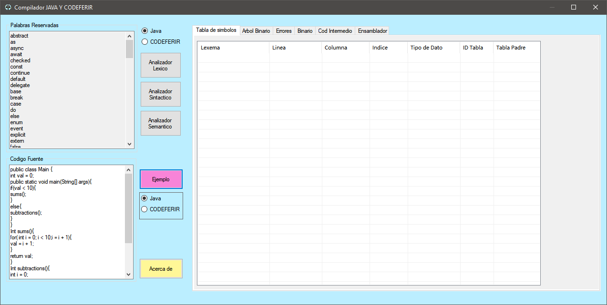
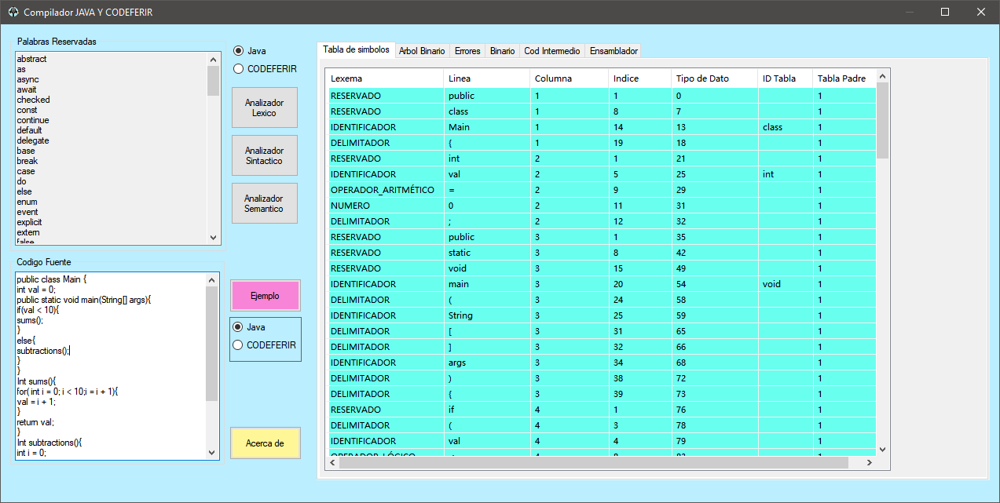
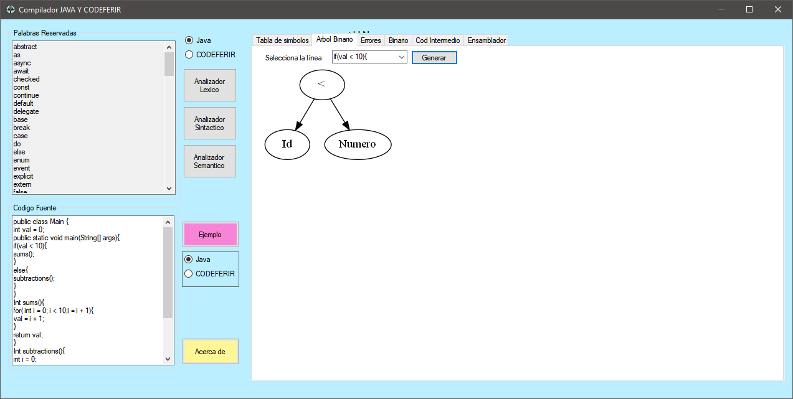
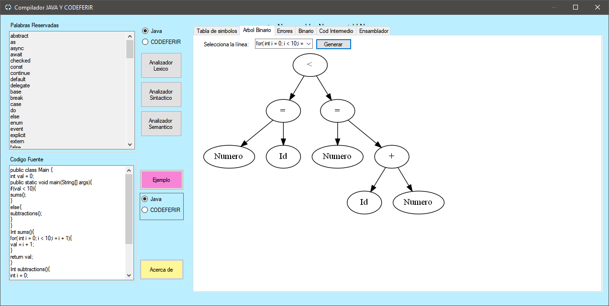
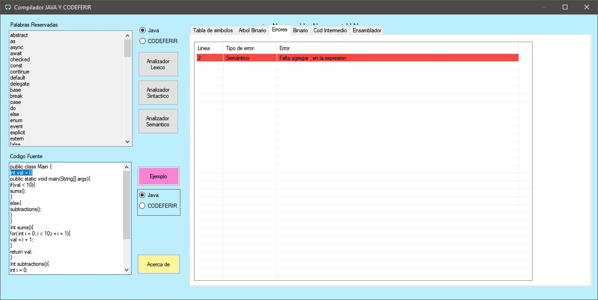
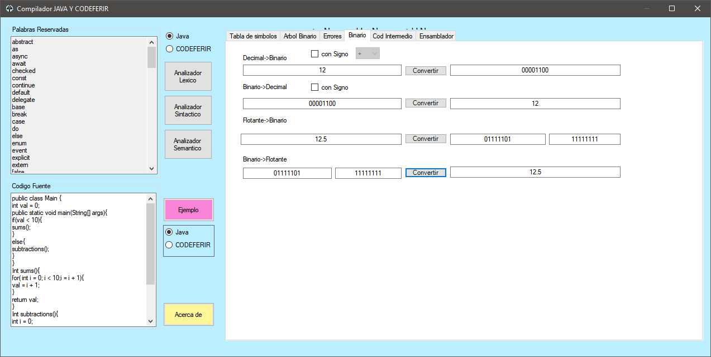
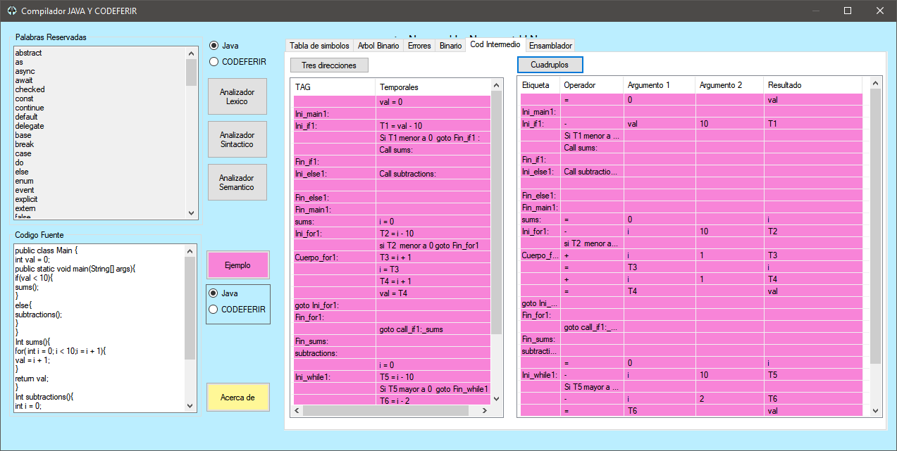
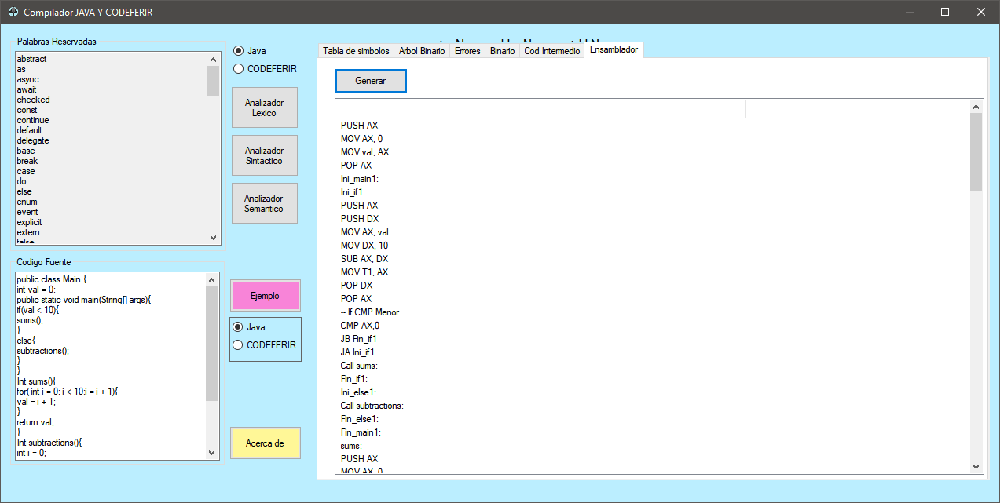

# Proyecto final para la materia de Automatas 2

## Aplicación en funcionamiento
### Analizadores 

### Funcionamiento del árbol binario

### Funcionamiento de Errores 

### Conversión de decimal a binario, de binario a decimal, de flotante a binario y de binario a flotante

### Funcionamiento de código intermedio 

### Funcionamiento de código ensamblador

### Para más información contactar a robertoesquiveltr16@gmail.com

## Autores

- Roberto Esquivel Troncoso  
- Ivan Herrera Garcia
- Fatima Gorety Garcia Yescas
- Isaias Gerardo Cordova Palomares
- Raul Galindo Sanches
